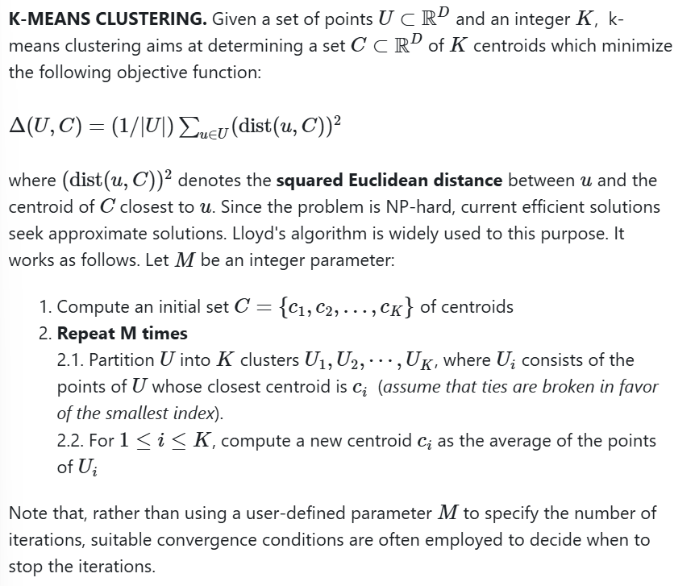
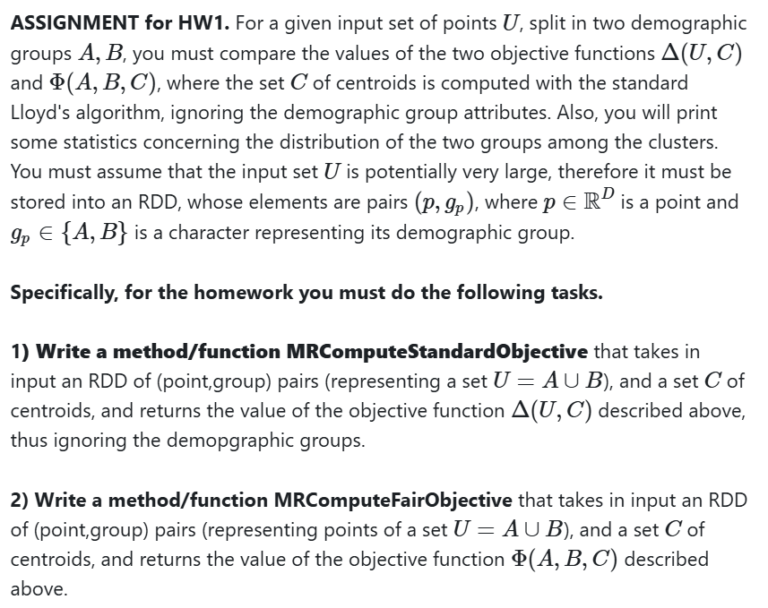
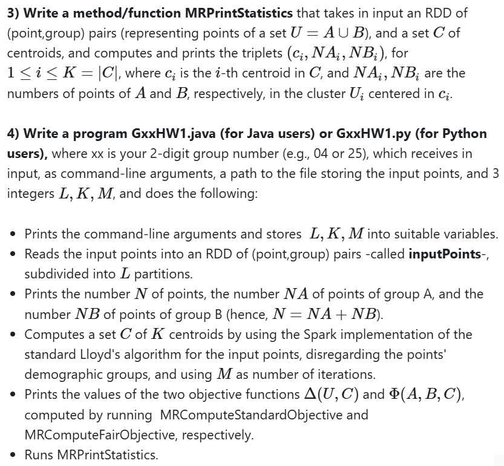
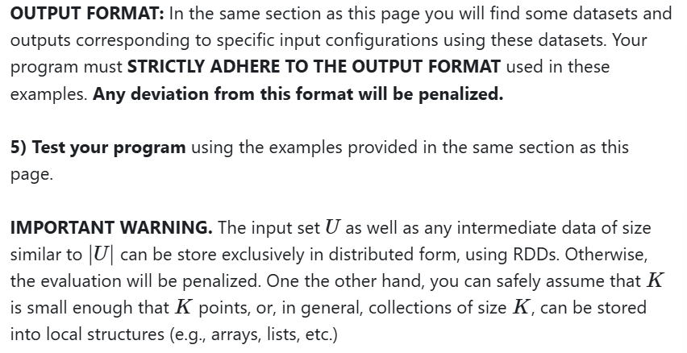
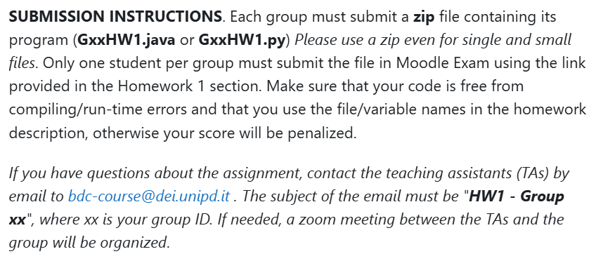

# Task

## Introduction
The purpose of the first homework is to get acquainted with Spark and with its use to implement MapReduce algorithms. In preparation for the homework, you must perform and test the set up of your machine, following the instructions given in this site. The homework concerns a variant of the classical Lloyd's algorithm for k-means clustering, which enforces a fairness constraint on the solution based on extra demographic information attached to the input points.  

## Problem and algorithm

## Spark implementation
SPARK IMPLEMENTATION of Lloyd's ALGORITHM. In the RDD-based API of the mllib package, Spark provides an implementation of LLoyd's algorithm for k-means clustering. In particular, the algorithm is implemented by method train of class KMeans which receives in input the points stored as an RDD of Vector in Java, and of NumPy arrays in Python, the number k of clusters, and the number of iterations. The method computes an initial set of centroids using, as a default, algorithm kmeans|| (a parallel variant of kmeans++), and then executes the specified number of iterations. As output the method returns the final set of centroids, represented as an instance of class KMeansModel. For this latter class, method clusterCenters will return the centroids as an array of Vector in Java and list of NumPy arrays in Python. Refer to the official Spark documentation on clustering (RDD-based API) for more details.

[Spark Documentation](https://spark.apache.org/docs/3.5.1/mllib-clustering.html#k-means)

## Fair K-Means

### Representation of points (JAVA Users) 
Points must be represented as instances of the class Vector of package mllib.linalg and can be manipulated through static methods offered by the class Vectors in the same package. For example, method Vectors.dense(x) transforms an array x of double into an instance of class Vector, while method Vectors.sqdist(x,y) computes the squared Euclidean distance between two instances, x and y, of class Vector. Details on these classes can be found in the Spark Java API.
Warning. Make sure to use the classes from the org.apache.spark.mllib package. There are classes with the same name in org.apache.spark.ml package which are functionally equivalent, but incompatible with those of the org.apache.spark.mllib package.

[Spark Java API](https://spark.apache.org/docs/latest/api/java/index.html)

### Input
To implement the algorithms assume that the input set U
is given in input as a file, where each row contains one point stored with the coordinates separated by comma (',') and, at then end, a character, A or B, representing the point's demographic group. For instance, a point p
= (1.5,6.0) ∈ R^2 of group A, will occur in the file as line: 1.5,6.0,A.

## Assignment

## Submission instructions

