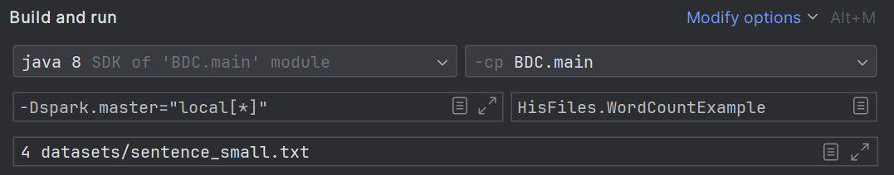

# Big Data Homework of Group 36
Repository for the Big Data Computing Homeworks. Group 36

[Link to Moodle](https://esami.elearning.unipd.it/course/view.php?id=6533)

## Structure of the project

- Folder `datasets` contains the datasets used
- Folder `src/HisFiles` contains the `WordCountExample.java` file, which can be used to test the settings
- Folder `src/BigDataHw` contains the files of the various homeworks, each one with a `README.md` file

## Compile and run in Intellij

To run it and pass the arguments, just use the top right settings of the run, see the settings of WordCountExample
