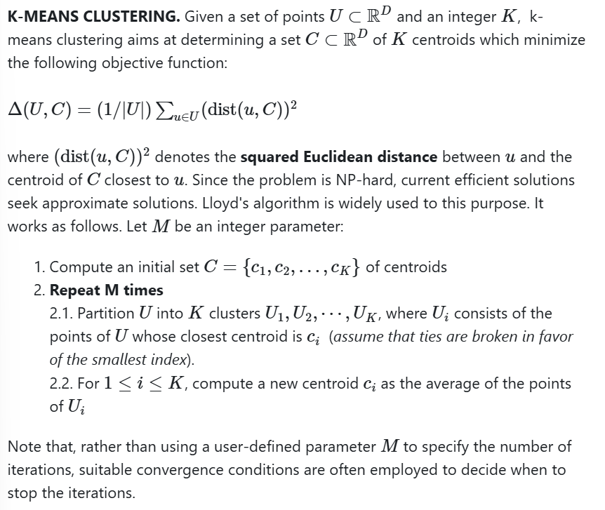
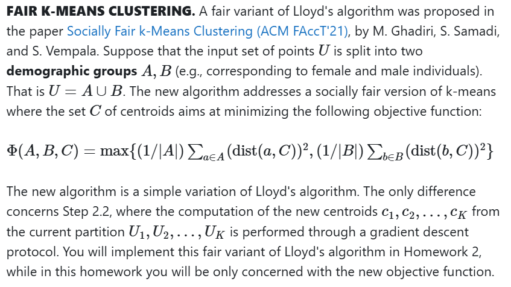
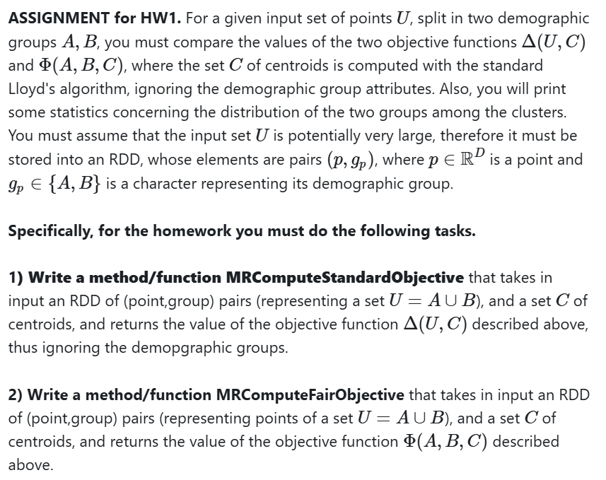
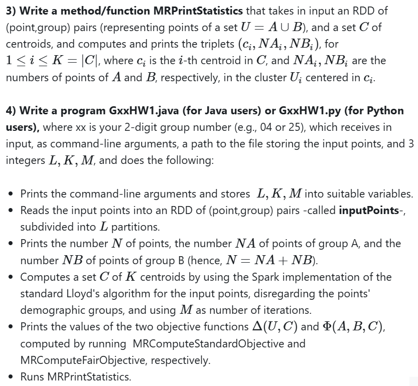
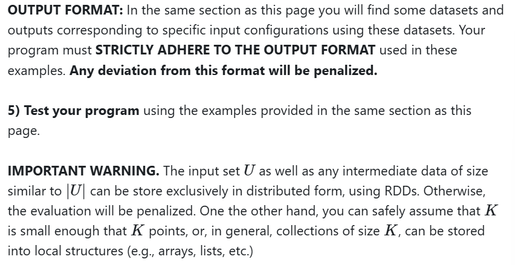
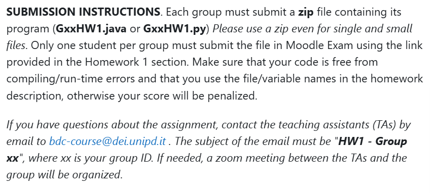

# Task

DEADLINE: 11th April 2025

## Introduction
The purpose of the first homework is to get acquainted with Spark and with its use to implement MapReduce algorithms. 
In preparation for the homework, you must perform and test the set-up of your machine, following the instructions given in this site. 
The homework concerns a variant of the classical Lloyd's algorithm for k-means clustering, which enforces a fairness constraint on 
the solution based on extra demographic information attached to the input points.  
For simplicity use a fixed M given as an input.

## Standard K-Means

### Spark implementation of Lloyd's algorithm
In the RDD-based API of the `mllib` package, Spark provides an implementation of 
LLoyd's algorithm for k-means clustering. 

In particular, the algorithm is implemented by method `train` of class `KMeans` which 
receives in input the points stored as an RDD of `Vector` in Java, and of NumPy arrays in Python, the number k of clusters, and 
the number of iterations. The method computes an initial set of centroids using, as a default, algorithm kmeans|| (a parallel variant 
of kmeans++), and then executes the specified number of iterations. As output the method returns the final set of centroids, 
represented as an instance of class `KMeansModel`. For this latter class, method `clusterCenters` will return the centroids as an 
array of `Vector` in Java and list of NumPy arrays in Python. 

Refer to the official Spark documentation on clustering (RDD-based API) for more details.
[Spark Documentation](https://spark.apache.org/docs/3.5.1/mllib-clustering.html#k-means)

## Fair K-Means

### Representation of points (JAVA Users) 
Points must be represented as instances of the class `Vector` of package `mllib.linalg` and can be manipulated through static methods 
offered by the class `Vectors` in the same package. For example, method `Vectors.dense(x)` transforms an array x of double into an 
instance of class `Vector`, while method `Vectors.sqdist(x,y)` computes the squared Euclidean distance between two instances, x and y, 
of class `Vector`. Details on these classes can be found in the Spark Java API.
Warning. Make sure to use the classes from the `org.apache.spark.mllib` package. There are classes with the same name in
`org.apache.spark.ml` package which are functionally equivalent, but incompatible with those of the `org.apache.spark.mllib` package.

[Spark Java API](https://spark.apache.org/docs/latest/api/java/index.html)

### Input
To implement the algorithms assume that the input set U is given in input as a file, where 
each row contains one point stored with the coordinates separated by comma (',') and, 
at then end, a character, A or B, representing the point's demographic group. 

For instance, a point p = (1.5,6.0) ∈ R^2 of group A, 
will occur in the file as line: \
1.5,6.0,A.

## Assignment
The RDD is called inputPoints, cache it so you don't need to recompute it multiple time.

## Submission instructions

