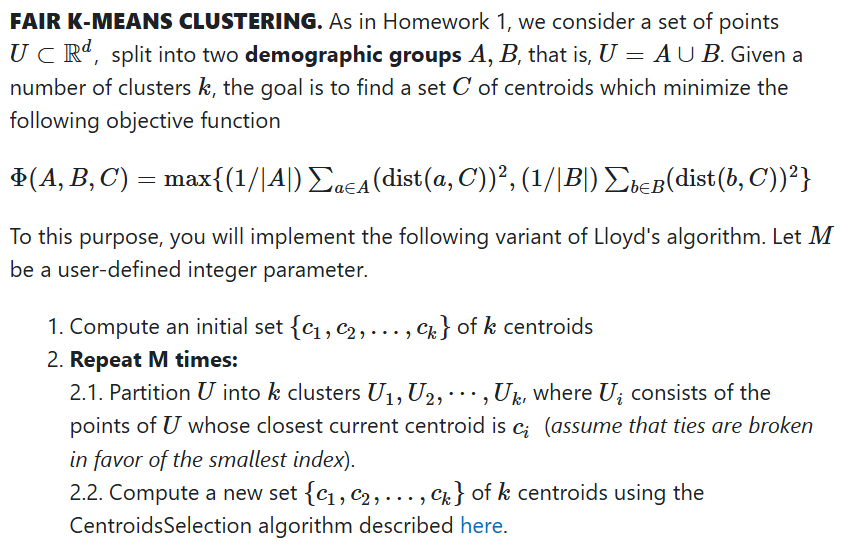
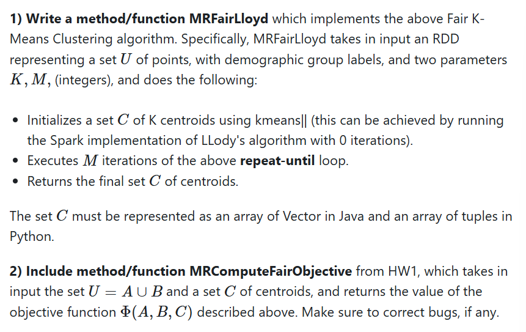
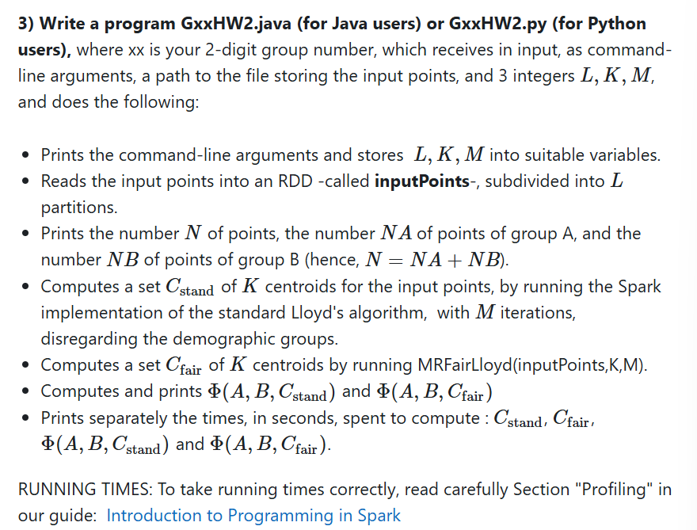
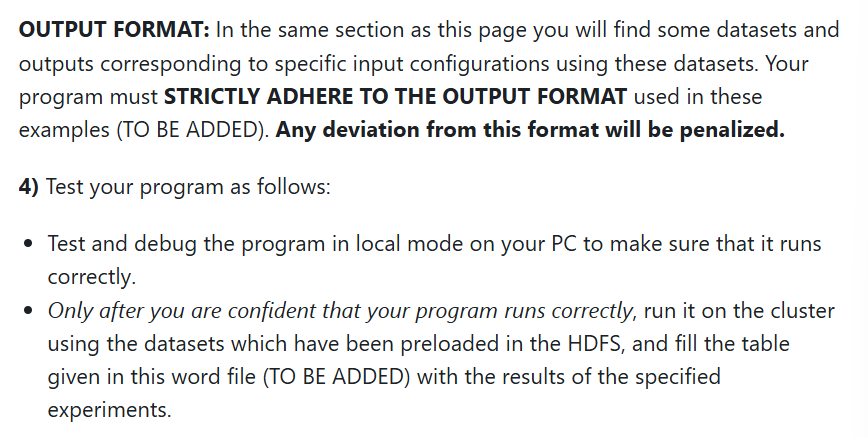
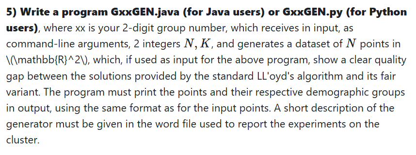
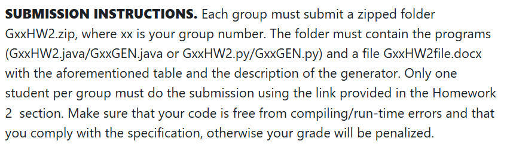

# Task

DEADLINE: 15th May 2025

## Introduction
The purpose of the second homework is to implement the 
variant of Lloyd's algorithm for fair k-means clustering, 
proposed in the paper Socially Fair k-Means Clustering 
(ACM FAccT'21), and to compare its effectiveness against 
the standard variant, with respect to the new objective 
function introduced in that paper. Moreover, you will test
the scalability of your implementation on the CloudVeneto cluster 
available for the course. To get access and to use the cluster 
you must strictly follow the rules indicated in the  
User guide for the CloudVeneto cluster which you can 
find in the same section as this specification.  
For this homework, you will be able to recycle most of 
the work done for Homework 1: make sure to correct bugs 
(if any) and to include the feedback we will give you on 
Homework 1.

## Fair K-Means Clustering

(Here refers to the slides)

### Input format and representation of points
For both issues please follow what done in Homework 1, correcting bugs, if any.

## Assignment

PROFILING: https://www.dei.unipd.it/~capri/BDC/SparkProgramming.html

### Cluster rules
* To avoid congestion, groups with even (resp., odd) 
  group number must use the clusters in even (resp., odd) days.
* Do not run several instances of your program at once. 
* Do not use more than 16 executors. 
* Try your program on a smaller dataset first. 
* Remember that if your program is stuck for more than 1 hour, its execution will be automatically stopped by the system.

https://esami.elearning.unipd.it/mod/page/view.php?id=85100

## Submission instructions
