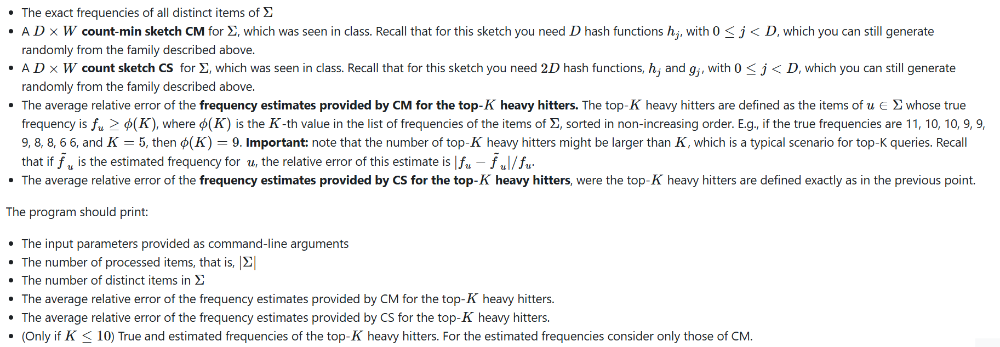

# Task

DEADLINE: 15th June 2025

## Streaming setting
For the homework, we created a server which generates a continuous stream of integer items. 
The server has been already activated on the machine algo.dei.unipd.it and emits 
the items (viewed as strings) on specific ports (from 8886 to 8889). Your program must 
first define a Spark Streaming Context sc that provides access to the stream through the method
socketTextStream which transforms the input stream, coming from the specified machine and port number, 
into a Discretized Stream (DStream) of batches of items. A batch consists of the items arrived during a 
time interval whose duration is specified at the creation of the context sc. Each batch is viewed as an RDD of strings, 
and a set of RDD methods are available to process it. A method foreachRDD is then invoked to 
process the batches one after the other. Typically, the processing of a batch entails the update 
of some data structures stored in the driver's local space (i.e., its working memory) which are needed to perform the r
equired analysis. The beginning/end of the stream processing will be set by invoking start/stop
methods from the context sc. Typically, the stop command is invoked after the desired number of items is processed.

The ports from 8886 to 8889 of algo.dei.unipd.it generate four streams of 32-bit integers:

* 8887: it generates a stream where a few elements are very frequent, while all the remaining are randomly selected in the 32-bit integer domain.  
* 8889: it generates a stream where a few elements are very frequent, some elements are moderately frequent, and all the remaining are randomly selected in the 32-bit  integer domain.  
* 8886: it is the "deterministic" version of the stream 8887, meaning that it generates the exact same stream every time you connect to this port. It should be used to test your algorithm.  
* 8888: it is the "deterministic" version of the stream 8889, meaning that it generates the exact same stream every time you connect to this port. It should be used to test your algorithm.

To learn more about Spark Streaming you may refer to the official Spark site. Relevant links are:
* Spark Streaming Programming Guide (full documentation) https://spark.apache.org/docs/latest/streaming-programming-guide.html
* Transformations on Streams (list of transformations applicable to the RDDs in a DStream) https://spark.apache.org/docs/latest/streaming-programming-guide.html#transformations-on-dstreams

## Example program

## Hash functions

# TASK

